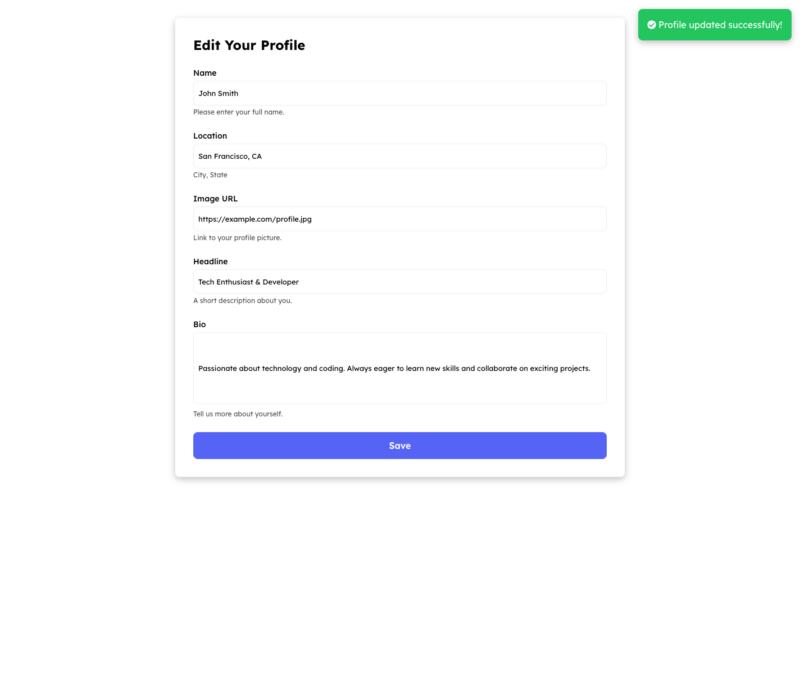

# ProfileKit

## **Overview**

A full-stack, single-user CMS profile editor, built to demonstrate clean full-stack architecture, UX clarity, and pragmatic use of AI as a pair-programming aid under a tight time box. It includes:

* A read-only profile display page at `/`
* A pre-filled edit form at `/edit`
* Persistent data handling using SQLite via Turso
* Modern stack with strong form validation, styling, and real-world UI feedback

## **Live Demo**

*This app runs locally using Turso. No public deployment included.*

## **Tech Stack**

* **Framework:** Next.js (App Router)
* **Language:** TypeScript
* **Database:** Turso (SQLite) with Drizzle ORM
* **Forms & Validation:** React Hook Form + Yup
* **Styling:** TailwindCSS
* **Feedback:** react-hot-toast
* **Build & Deployment:** Vercel (stretch goal)
* **Testing (planned):** Jest, React Testing Library, cypress
* **AI Usage:** ChatGPT (Ask Mode)

## **Project Structure**

```
src/
├── app/
│   ├── edit/               // Profile form
│   ├── layout.tsx
│   └── page.tsx           // View profile
├── db/
│   ├── db.ts              // Turso connection
│   ├── schema.ts          // Drizzle schema
│   └── schema.sql         // Raw SQL schema
├── lib/
│   └── validation.ts      // Yup schema
├── components/            // Optional UI elements

public/
.env.local
```

## **Installation & Setup**

```bash
git clone https://github.com/Younique98/profilekit.git
cd profilekit
npm install
npm run dev
```

Then open [http://localhost:3000](http://localhost:3000)

## **Features & Implementation**

### **1. Profile View Page (`/`)**

* Displays all profile fields
* Tailwind styled card layout

### **2. Edit Profile Form (`/edit`)**

* Prefilled values via fetch
* RHF with Yup validation
* Tailwind styled inputs
* Success and error feedback with toasts

### **3. API Route**

* Custom route using Drizzle and Turso
* Uses safe parse and validation layer
* POST request updates database

### **4. Toast Feedback**

* `react-hot-toast` for error and success
* Shows clear confirmation after form submission

### **5. Loading State (Planned)**

* Add skeleton component or shimmer effect during data fetch
* Improve perceived performance and polish

## **Testing Strategy**

Testing was not prioritized due to time scope but if extended:

* Unit tests for form validation and API route
* Integration test for `/edit` to `/` update flow
* Accessibility testing with axe-core

## **Future Considerations**

* Add image preview for avatar URL
* Add loading spinner during fetch/post
* Transition to server actions if expanding architecture
* Add user auth and multi-profile support

## **Contributing**

Not applicable — this is a self-contained solo build.

## **Design Reference**

These mockups reflect the final intended layout and UX for both the view and edit routes.

### `/` — View Profile Page


---

### `/edit` — Edit Profile Page


